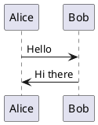

# PlantUML Installation Guide

PlantUML is a tool for creating UML diagrams from plain text descriptions. This guide covers installation on macOS and Ubuntu Linux.

## Prerequisites

PlantUML requires Java to run. Make sure you have Java 8 or later installed.

### Check Java Installation
```bash
java -version
```

If Java is not installed, follow the Java installation section below.

## macOS Installation

### Method 1: Using Homebrew (Recommended)

1. **Install Homebrew** (if not already installed):
   ```bash
   /bin/bash -c "$(curl -fsSL https://raw.githubusercontent.com/Homebrew/install/HEAD/install.sh)"
   ```

2. **Install Java** (if needed):
   ```bash
   brew install openjdk
   ```

3. **Install PlantUML**:
   ```bash
   brew install plantuml
   ```

4. **Verify installation**:
   ```bash
   plantuml -version
   ```

### Method 2: Manual Installation

1. **Install Java** (if needed):
   - Download from [Oracle](https://www.oracle.com/java/technologies/downloads/) or [OpenJDK](https://openjdk.org/)

2. **Download PlantUML JAR**:
   ```bash
   curl -L -o ~/plantuml.jar https://github.com/plantuml/plantuml/releases/latest/download/plantuml.jar
   ```

3. **Create wrapper script**:
   ```bash
   echo '#!/bin/bash' > /usr/local/bin/plantuml
   echo 'java -jar ~/plantuml.jar "$@"' >> /usr/local/bin/plantuml
   chmod +x /usr/local/bin/plantuml
   ```

## Ubuntu Linux Installation

### Method 1: Using APT (Recommended)

1. **Update package list**:
   ```bash
   sudo apt update
   ```

2. **Install Java** (if needed):
   ```bash
   sudo apt install default-jre
   ```

3. **Install PlantUML**:
   ```bash
   sudo apt install plantuml
   ```

4. **Verify installation**:
   ```bash
   plantuml -version
   ```

### Method 2: Using Snap

1. **Install PlantUML via Snap**:
   ```bash
   sudo snap install plantuml
   ```

### Method 3: Manual Installation

1. **Install Java** (if needed):
   ```bash
   sudo apt install default-jre
   ```

2. **Download PlantUML JAR**:
   ```bash
   wget -O ~/plantuml.jar https://github.com/plantuml/plantuml/releases/latest/download/plantuml.jar
   ```

3. **Create wrapper script**:
   ```bash
   sudo tee /usr/local/bin/plantuml > /dev/null << 'EOF'
   #!/bin/bash
   java -jar ~/plantuml.jar "$@"
   EOF
   sudo chmod +x /usr/local/bin/plantuml
   ```

## Usage Examples

### Basic Usage
```bash
# Generate PNG from PlantUML file
plantuml diagram.puml

# Generate SVG
plantuml -tsvg diagram.puml

# Generate PDF
plantuml -tpdf diagram.puml
```

### Sample PlantUML File
Create a file called `sample.puml`:


Generate the diagram:
```bash
plantuml sample.puml
```

## Additional Tools (Optional)

### Graphviz (for better diagram rendering)

**macOS:**
```bash
brew install graphviz
```

**Ubuntu:**
```bash
sudo apt install graphviz
```

## Troubleshooting

### Common Issues

1. **Java not found**: Make sure Java is installed and in your PATH
2. **Permission denied**: Ensure the plantuml script has execute permissions
3. **OutOfMemory errors**: Increase Java heap size:
   ```bash
   java -Xmx1024m -jar plantuml.jar diagram.puml
   ```

### Verify Installation
```bash
# Check PlantUML version
plantuml -version

# Test with a simple diagram
echo '@startuml
Alice -> Bob: test
@enduml' | plantuml -pipe > test.png
```

## Integration with IDEs

- **VS Code**: Install "PlantUML" extension
- **IntelliJ IDEA**: Install "PlantUML integration" plugin
- **Vim**: Use plantuml-syntax plugin

For more information, visit the [official PlantUML website](https://plantuml.com/).